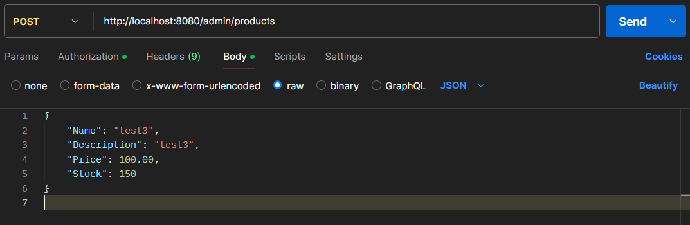

# This is the basic and straightforward structure of a CRUD system using Golang and MySQL.

## The system includes the following:

* Create: Creating a Product ✔️
* Read: Retrieving a Product ✔️
* Update: Editing or updating product details ✔️
* Delete: Deleting a Product ✔️

## 🔐 Authentication System
The system includes Login & Register functionalities, along with the generation of JWT (JSON Web Token). It also separates functions between the user and admin roles.

 ## 🔨 Setting Up Go Modules

``` bash
    go mod init your-module
  ```
After generating the go.mod file, you can install dependencies using the following command:

## 📦 Dependency Installation

``` bash
    go get [package]
  ```
##  For this project, we use

  ``` bash
    go get github.com/gin-gonic/gin
    go get github.com/go-sql-driver/mysql
    go get github.com/dgrijalva/jwt-go
    go get golang.org/x/crypto/bcrypt   
  ```
## 🔄 Cleaning Up Dependencies

To remove unused dependencies and ensure `go.mod` and `go.sum` are up to date, run:

```bash
    go mod tidy
```
## 🔧 Setup Your Database Connection

Before running the project, configure your database connection in the code.

### **Database Configuration**
Modify the following parameters in your Go application:

```go
// Database connection parameters
dbUsername := "root" // Change to your database username
dbPassword := "" // Change to your database password
dbHost := "localhost" // Use "localhost" or "127.0.0.1" if connecting via a network
dbPort := "3306" // MySQL port default 
dbName := "" // Your database name
```

## 🚀 Running the Project

To start the server, run the following command:
```bash
    go run main.go
```
By default, the server runs on http://localhost:8080

## 📬 Testing API with Postman

To test the API endpoints, it is recommended to use [Postman](https://www.postman.com/).

### **How to Use Postman:**
1. **Download and Install Postman**  
   - Get it from [here](https://www.postman.com/downloads/).
   
2. **Send API Requests**  
   - Open Postman and create a new request.  
   - Set the request type (GET, POST, PUT, DELETE).  
   - Enter the API URL (e.g., `http://localhost:8080/admin/products`).  
   - If authentication is required, add a Bearer Token in the **Authorization** tab.  
   

   - For `POST` and `PUT` requests, go to the **Body** tab and choose **raw** → **JSON** format.  
   
   **Example JSON Request:** 
    ```Json
     {
     "Name": "test",
        "Description": "test",
        "Price": 100.00,
        "Stock": 150
     }
    ```


3. **Check Responses**  
   - Click "Send" and review the API response.  
   - If there are errors, check the server logs for debugging.  

Using Postman simplifies API testing and ensures everything works correctly before integrating into your application. 🚀

## 💡 **Tip:**  
If you're unsure about the required data structure for each function,  
you can check the **data struct** in the corresponding model file:  

📂 **models/[filename].go**  
#


##### This project is created by someone who is just starting to learn Golang and wants to share this information with others who are new to the language.
##### Feel free to adapt it to fit your own project needs.

# 🎉 Enjoy using this system. Thank you! 🎉
